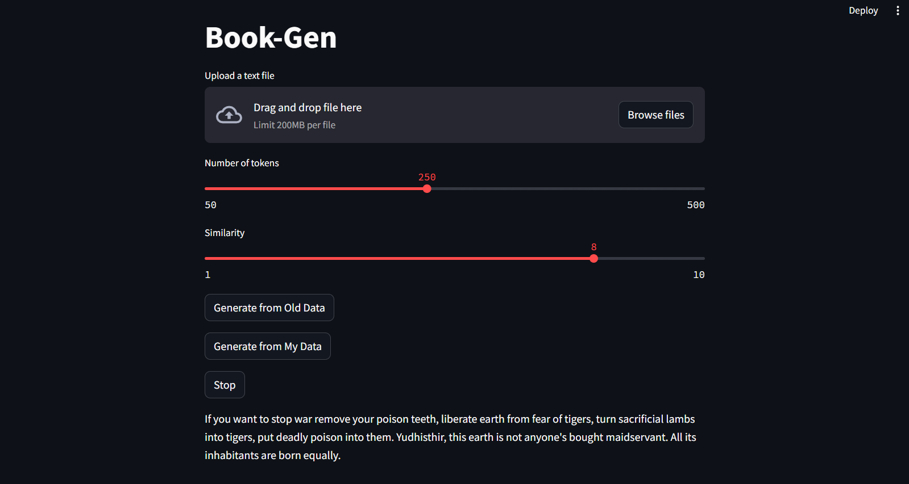

# Book Generation

This project allows users to generate text data using self-attention and transformer's decoder only block, implemented with PyTorch. The interface is built using Streamlit, making it easy for users to interact with the text generation model.

## Usage

1. **Clone the Repository:**
   ```bash
   git clone https://github.com/k25harikesh/Book-Gen.git

2. **Install Dependencies:**
    ```bash
    pip install -r requirements.txt

3. **Run the Streamlit App:**
    ```bash
    streamlit run book_gen.py

## Interact with the Interface:

- Use the "Generate from Old Data" button to generate text based on pretrained parameters.
- Use the "Generate from My Data" button to upload your own text data, train the model, and generate text similar to your data.

## Features:

- **Self-Attention:** The model uses self-attention mechanisms to weigh the importance of different words in the input text, allowing it to capture long-range dependencies more effectively.
  
- **Transformer Decoder Block:** The transformer decoder block is employed to process the encoded input and generate meaningful output text.
  
- **Streamlit Interface:** Streamlit is utilized to create an intuitive user interface for interacting with the text generation model.
  
- **Pretrained Data Generation:** The model can generate text data based on its pretrained parameters, allowing users to explore its capabilities without additional training.


  
- **Custom Data Training:** Users can provide their own text data, train the model locally, and then use the trained model to generate text similar to the provided data.

